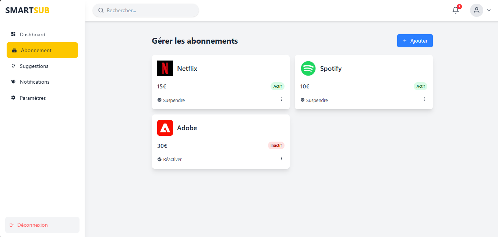

# SmartSub Frontend

[](./Smart_sub.PNG)

**SmartSub** is a personal subscription manager that helps you easily track and manage all your subscriptions. With a user-friendly dashboard and smart suggestions, you can optimize your spending and discover better or cheaper alternatives.

---

## Features

- **Add, Edit, Delete Subscriptions:** Manage all your recurring expenses in one place.
- **Dashboard Overview:** Visualize all your active subscriptions at a glance.
- **Smart Suggestions:** Get recommendations for alternative services that may be cheaper or better.
- **Seamless Experience:** Fast, responsive UI built with React and TailwindCSS.

---

## Tech Stack

- **Frontend:** [React](https://react.dev/), [TailwindCSS](https://tailwindcss.com/)
- **Backend:** [Spring Boot](https://github.com/alyhoussen/smartsub_backend)
- **Database:** PostgreSQL

---

## Getting Started

### Prerequisites

- [Node.js](https://nodejs.org/) (v16+)
- [npm](https://www.npmjs.com/) or [yarn](https://yarnpkg.com/)
- [SmartSub Backend](https://github.com/alyhoussen/smartsub_backend) running locally or remotely

### Installation

1. **Clone the repo:**
   ```bash
   git clone https://github.com/alyhoussen/smartsub_frontend.git
   cd smartsub_frontend
   ```

2. **Install dependencies:**
   ```bash
   npm install
   # or
   yarn install
   ```

3. **Configure API endpoint:**  
   Edit `.env` or `.env.example` to set your backend API URL.

4. **Start the frontend server:**
   ```bash
   npm run dev
   # or
   yarn dev
   ```

5. **Access the app:**  
   Visit [http://localhost:3000](http://localhost:3000) in your browser.

---

## Project Structure

```
smartsub_frontend/
├── public/
├── src/
│   ├── components/
│   ├── pages/
│   ├── App.jsx
│   └── ...
├── tailwind.config.js
├── package.json
└── screenshot.png
```

---

## Backend

The frontend requires the [SmartSub Backend](https://github.com/alyhoussen/smartsub_backend), which is built with Spring Boot and uses PostgreSQL for data storage.  
Please ensure the backend is running and accessible.

---

## Contributing

Contributions are welcome!  
Open an issue or submit a pull request for bug fixes or new features.

---

## License

MIT License © 2025 Aly Houssen
